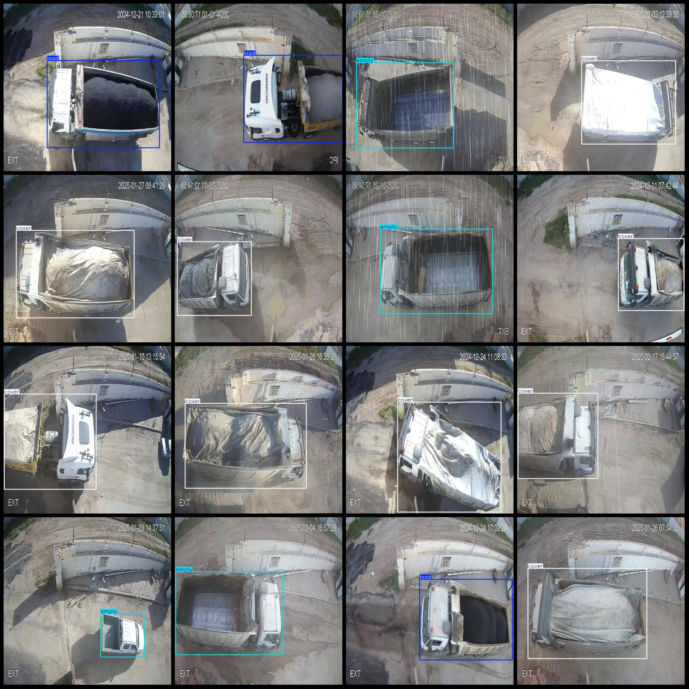
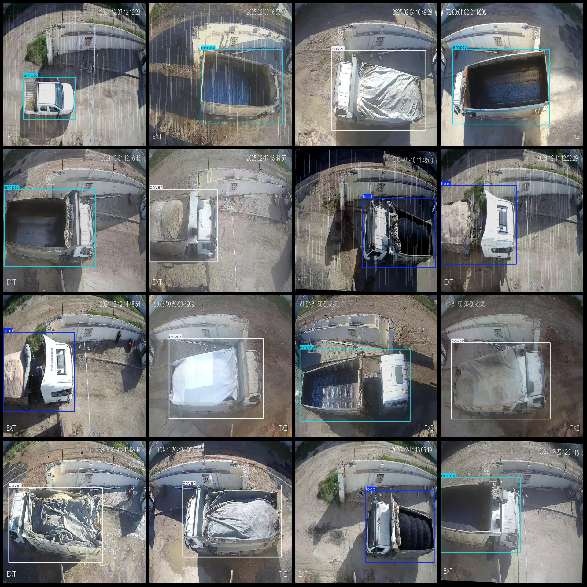

# Vertical Monitoring Perspective Truck Loading State Detection Dataset VOC+YOLO Format with 3033 Images and 3 Categories

Dataset Format: Pascal VOC format + YOLO format (txt file without split paths, only containing jpg images and corresponding VOC-format xml files and YOLO-format txt files)
Image Count (Number of jpg files): 3033
Annotation Count (Number of xml files): 3033
Annotation Count (Number of txt files): 3033
Number of Annotation Categories: 3
Annotation Category Names (Note that the order of categories in the YOLO format may not match this, but refer to the labels folder "classes.txt"): ["cover", "empty", "load"]
Box Count for Each Category:
- cover (Pitched Cover) Boxes = 992
- empty (Empty) Boxes = 1118
- load (Load) Boxes = 927
Total Boxes: 3037
Number of Images per Category:
- cover (Pitched Cover) Images = 991
- empty (Empty) Images = 1117
- load (Load) Images = 927
Image Resolution: 640x640
Annotation Tool Used: labelImg
Annotation Rules: Draw boxes around categories
Important Note: The dataset does not have been split into training, validation, or test sets; you will need to do so yourself.
Special Remark: This dataset does not guarantee the accuracy of the trained models or weight files.
Image Preview:
Annotation Example:

## Images

Here is a pay link on Stripe ( https://buy.stripe.com/3cs8yP7sY87d0vu9AB ). Please contact me lonlonago@foxmail.com after funding $89, and I will send you a complete data files , thank you!

